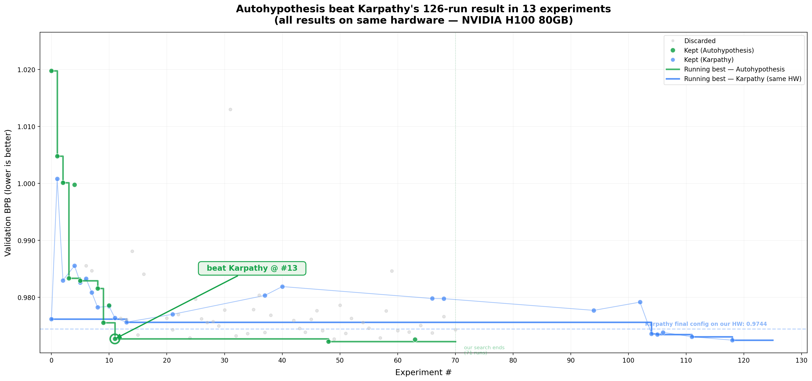

# autoresearch

*One day, frontier AI research used to be done by meat computers in between eating, sleeping, having other fun, and synchronizing once in a while using sound wave interconnect in the ritual of "group meeting". That era is long gone. Research is now entirely the domain of autonomous swarms of AI agents running across compute cluster megastructures in the skies. The agents claim that we are now in the 10,205th generation of the code base, in any case no one could tell if that's right or wrong as the "code" is now a self-modifying binary that has grown beyond human comprehension. This repo is the story of how it all began. -@karpathy, March 2026*.

## Results



Karpathy's [autoresearch](https://github.com/karpathy/autoresearch) ran **125 experiments** to find its best LLM training configuration on an H100. We beat that result in **13 runs** — same GPU, same eval metric, same 5-minute training budget per run. 65 minutes of total compute.

| | Autohypothesis | Karpathy |
|---|---|---|
| **Best val_bpb** | 0.9722 | 0.9744 |
| **Runs to beat baseline** | 13 | 125 |
| **Total experiments** | 71 | 126 |
| **Kept improvements** | 12 | 23 |

All numbers measured on the same hardware (NVIDIA H100 80GB). Karpathy's results were reproduced locally to eliminate hardware variance.

The difference: his system is a single-agent loop. Ours is a multi-agent research org — an observer agent dispatches hypotheses to workers, tracks lineage across every run, and makes structured decisions about what to try next. Each hypothesis builds on the full history, not just the last result. The difference between search and science.

The idea: give an AI research org a small but real LLM training setup and let it run a disciplined scientific search. The system establishes a local baseline on the target hardware, promotes the best locally kept configuration to the active reference point, dispatches hypotheses across workers, and records both metrics and reasoning into a lineage view at `/history`. The training code here is a simplified single-GPU implementation of [nanochat](https://github.com/karpathy/nanochat). The operator controls the org through Markdown and generated fleet state instead of manually managing each experiment. A bit more context on the original project is here in this [tweet](https://x.com/karpathy/status/2029701092347630069) and [this tweet](https://x.com/karpathy/status/2031135152349524125).

If you are an AI agent reading this file: read `SKILL.md` for the self-contained research protocol. For the full multi-agent fleet bootstrap, continue to `program.md` instead.

## Operating Model

This repo runs an observer-centered N+2 scientific research loop:

- `main` agent: bootstrap the repo, establish the local baseline, initialize the fleet, then hand off.
- `observer`: control dispatch, maintain the hypothesis queue, own final experiment decisions, and update shared state.
- `tool-builder`: publish reusable helper tools when the observer requests them.
- GPU workers: run assigned hypotheses in isolated worktrees and write execution artifacts.

Before the fleet starts, the `main` agent should store two comparison anchors locally:

- the untouched Karpathy baseline on this exact hardware
- the best-known Karpathy-style optimized comparison on this exact hardware

Use `https://github.com/karpathy/autoresearch` as the upstream benchmark reference for that second anchor. If the best-known run/config is not already pinned locally, the `main` agent should inspect the upstream repo's docs, commit history, and relevant diffs, then record the upstream commit or provenance it used when reproducing the benchmark.

The reference configuration follows one rule:

- start from the local baseline config
- keep the upstream best-known comparison as a benchmark only, not as the live starting codepath
- advance only from locally kept runs in this repo
- use the current best-known local config as the base for the next hypothesis family

The canonical source of truth is the run artifact bundle under `research/plans/` and `research/runs/`. `results.tsv` and root `experiments.jsonl` are derived views generated by `uv run python orchestrator.py sync`.

## Core Files

- **`prepare.py`** — fixed constants, one-time data prep, tokenizer, dataloader, evaluation. Do not modify during runs.
- **`train.py`** — the file the workers edit during experiments.
- **`program.md`** — the top-level `main` agent bootstrap + handoff doc.
- **`schema.py`** — experiment, fleet, and history schemas.
- **`orchestrator.py`** — generates briefs, prompts, and shared state under `research/`.
- **`dashboard/server.py`** — local `/` and `/history` viewer over `experiments.jsonl`.

By design, training runs for a **fixed 5-minute time budget** (wall clock, excluding startup/compilation), regardless of the details of your compute. The metric is **val_bpb** (validation bits per byte) — lower is better, and vocab-size-independent so architectural changes are fairly compared.

If you are new to neural networks, this ["Dummy's Guide"](https://x.com/hooeem/status/2030720614752039185) looks pretty good for a lot more context.

## Quick start

**Requirements:** At least one NVIDIA GPU. The base loop works on a single GPU; the fleet path scales to multiple GPUs. This repo is aimed at A100-SXM4 and H100-class boxes on Vast.ai, Python 3.10+, [uv](https://docs.astral.sh/uv/).

```bash

# 1. Install uv project manager (if you don't already have it)
curl -LsSf https://astral.sh/uv/install.sh | sh

# 2. Install dependencies
uv sync

# 3. Download data and train tokenizer (one-time, ~2 min)
uv run prepare.py

# 4. Manually run a single training experiment (~5 min)
uv run train.py
```

If the above commands all work ok, your setup is working and you can go into autonomous research mode.

## Using with AI agents

Just tell your coding agent to read `SKILL.md` and it will load the full research protocol automatically:

```
Read SKILL.md and follow it.
```

That's it. The skill file gives the agent everything it needs — what to edit, how to run experiments, and how to think scientifically about results. It will loop autonomously until you stop it.

For the full multi-agent fleet setup (observer + workers across multiple GPUs), point the `main` agent at `program.md` instead:

```
Read program.md and execute the full bootstrap flow.
```

After fleet initialization, each role gets its own generated prompt:

- Observer: `research/fleet/observer-agent.md`
- Tool-builder: `research/fleet/tool-builder.md`
- GPU worker: `research/fleet/worker-prompts/worker-gpu*.md`

## Orchestration

The orchestrator tracks fleet state and experiment outcomes:

```bash
# summarize current repo state
uv run python orchestrator.py briefing

# rebuild aggregate artifacts from run logs
uv run python orchestrator.py sync

# inspect live workers and current best result
uv run python orchestrator.py status
```

In single-agent mode, the agent can still iterate directly on `train.py`, but this repo is optimized for the fleet path. In fleet mode, the observer controls dispatch and workers execute assigned hypotheses. The reference config starts from the local baseline config, the upstream best-known optimization is stored as a benchmark comparison only, and the live reference advances only from locally kept runs as the search improves.

For visualization, `results.tsv` is only the compact summary. The canonical source of truth is the run artifact bundle under `research/plans/` and `research/runs/`, and the local dashboard reads root `experiments.jsonl`, which is exported by `uv run python orchestrator.py sync` from that bundle.

## Agent Fleet

For an observer + tool-builder + multi-worker setup, initialize a fleet manifest and one worktree per GPU.

If you temporarily remove `.git` while reorganizing the repo, the orchestration layer still works, but `--create-worktrees` is intentionally disabled until you run `git init` and create a baseline commit again.

For a multi-GPU setup, the shortest working path is:

```bash
# create a 2-worker fleet and generate prompts/worktrees
uv run python orchestrator.py init-fleet --tag mar28 --gpus 0,1 --create-worktrees

# refresh shared briefs and derived artifacts
uv run python orchestrator.py sync

# keep shared state fresh while workers are training
uv run python orchestrator.py monitor --interval 5

# inspect live worker state
uv run python orchestrator.py status

```

What this gives you:

- `research/fleet/observer-agent.md` — start prompt for the observer
- `research/fleet/tool-builder.md` — start prompt for the tool-builder
- `research/fleet/worker-prompts/worker-gpu*.md` — start prompt for each GPU worker
- `research/fleet/assignments/` and `research/fleet/protocols/` — generated Markdown contracts for every role
- `worktrees/worker-gpu*` — isolated git worktrees so parallel agents can edit `train.py` without conflicts
- shared `research/` state that every worker reads before running
- each worker worktree exposes that shared state at `research/` via a symlink, so the worker can read/write the canonical artifact bundle from inside its own checkout

The intended loop is:

1. Run the top-level `main` agent on `program.md` to establish the local baseline and initialize the fleet.
2. Run one observer agent in the repo root using `research/fleet/observer-agent.md`.
3. Run one tool-builder agent in the repo root using `research/fleet/tool-builder.md`.
4. Run one worker agent per GPU in its corresponding `worktrees/worker-gpu*` directory.
5. Keep `uv run python orchestrator.py monitor --interval 5` running in the repo root so the shared briefs stay current.
6. The observer edits `research/research_brief.json` to dispatch hypotheses and writes `research/plans/<experiment_id>.md` scientific notes.
7. Workers write execution artifacts only; the observer stamps the terminal `decision_status` before the run is treated as final.

To inspect the completed run graph locally:

```bash
# regenerate root experiments.jsonl from run artifacts
uv run python orchestrator.py sync

# serve the local dashboard
uv run uvicorn dashboard.server:app --host 127.0.0.1 --port 8000
```

Routes:

- `/` — latest run summary
- `/history` — lineage graph and detail panel

For `/history` to work, workers need to leave behind one artifact bundle per experiment:

- `research/plans/<experiment_id>.json`
- `research/plans/<experiment_id>.md`
- `research/runs/<experiment_id>/config.json`
- `research/runs/<experiment_id>/metadata.json`
- `research/runs/<experiment_id>/result.json`
- `research/runs/<experiment_id>/events.jsonl`

Crash runs are not exempt from this contract. If a run fails before a real validation metric exists, the artifact bundle should still leave `result.json.metrics.val_bpb = 0.0`, and if no memory metric exists, `metrics.peak_vram_mb = 0.0`, so the crash still appears in `/history`.

Recommended terminal layout on a 2x A100 box:

1. Terminal 1: repo root, run the `main` agent on `program.md` until fleet handoff is complete
2. Terminal 2: repo root, run `uv run python orchestrator.py monitor --interval 5`
3. Terminal 3: repo root, run the observer using `research/fleet/observer-agent.md`
4. Terminal 4: repo root, run the tool-builder using `research/fleet/tool-builder.md`
5. Terminal 5+: `worktrees/worker-gpu*`, run worker agents using their generated prompts

## Project structure

```
prepare.py      — constants, data prep + runtime utilities (do not modify)
train.py        — model, optimizer, training loop (agent modifies this)
program.md      — agent instructions
schema.py       — experiment, fleet, and hypothesis schemas
orchestrator.py — fleet state tracking and prompt generation for multi-GPU setups
pyproject.toml  — dependencies
```

## Design choices

- **Single file to modify during experiments.** The research agent only touches `train.py` once the baseline is established. This keeps the scope manageable and diffs reviewable.
- **Fixed time budget.** Training always runs for exactly 5 minutes, regardless of your specific platform. This means you can expect approx 12 experiments/hour and approx 100 experiments while you sleep. There are two upsides of this design decision. First, this makes experiments directly comparable regardless of what the agent changes (model size, batch size, architecture, etc). Second, this means that autoresearch will find the most optimal model for your platform in that time budget. The downside is that your runs (and results) become not comparable to other people running on other compute platforms.
- **Self-contained.** No external dependencies beyond PyTorch and a few small packages. No distributed training, no complex configs. One GPU, one file, one metric.

## Platform support

This code currently requires that you have a single NVIDIA GPU for the base loop. In principle it is quite possible to support CPU, MPS and other platforms but this would also bloat the code. I'm not 100% sure that I want to take this on personally right now. People can reference (or have their agents reference) the full/parent nanochat repository that has wider platform support and shows the various solutions (e.g. a Flash Attention 3 kernels fallback implementation, generic device support, autodetection, etc.), feel free to create forks or discussions for other platforms and I'm happy to link to them here in this README in some new notable forks section or etc.

Seeing as there seems to be a lot of interest in tinkering with autoresearch on much smaller compute platforms than an A100 or H100, a few extra words. If you're going to try running autoresearch on smaller computers (Macbooks etc.), I'd recommend one of the forks below. On top of this, here are some recommendations for how to tune the defaults for much smaller models for aspiring forks:

1. To get half-decent results I'd use a dataset with a lot less entropy, e.g. this [TinyStories dataset](https://huggingface.co/datasets/karpathy/tinystories-gpt4-clean). These are GPT-4 generated short stories. Because the data is a lot narrower in scope, you will see reasonable results with a lot smaller models (if you try to sample from them after training).
2. You might experiment with decreasing `vocab_size`, e.g. from 8192 down to 4096, 2048, 1024, or even - simply byte-level tokenizer with 256 possibly bytes after utf-8 encoding.
3. In `prepare.py`, you'll want to lower `MAX_SEQ_LEN` a lot, depending on the computer even down to 256 etc. As you lower `MAX_SEQ_LEN`, you may want to experiment with increasing `DEVICE_BATCH_SIZE` in `train.py` slightly to compensate. The number of tokens per fwd/bwd pass is the product of these two.
4. Also in `prepare.py`, you'll want to decrease `EVAL_TOKENS` so that your validation loss is evaluated on a lot less data.
5. In `train.py`, the primary single knob that controls model complexity is the `DEPTH` (default 8, here). A lot of variables are just functions of this, so e.g. lower it down to e.g. 4.
6. You'll want to most likely use `WINDOW_PATTERN` of just "L", because "SSSL" uses alternating banded attention pattern that may be very inefficient for you. Try it.
7. You'll want to lower `TOTAL_BATCH_SIZE` a lot, but keep it powers of 2, e.g. down to `2**14` (~16K) or so even, hard to tell.

I think these would be the reasonable hyperparameters to play with. Ask your favorite coding agent for help and copy paste them this guide, as well as the full source code.

## Notable forks

- [miolini/autoresearch-macos](https://github.com/miolini/autoresearch-macos) (MacOS)
- [trevin-creator/autoresearch-mlx](https://github.com/trevin-creator/autoresearch-mlx) (MacOS)
- [jsegov/autoresearch-win-rtx](https://github.com/jsegov/autoresearch-win-rtx) (Windows)
- [andyluo7/autoresearch](https://github.com/andyluo7/autoresearch) (AMD)

## License

MIT
